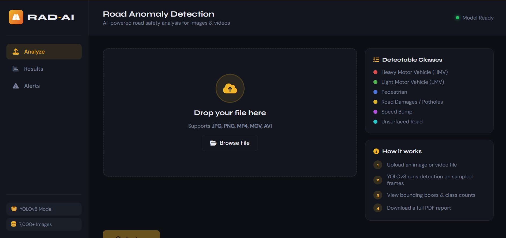
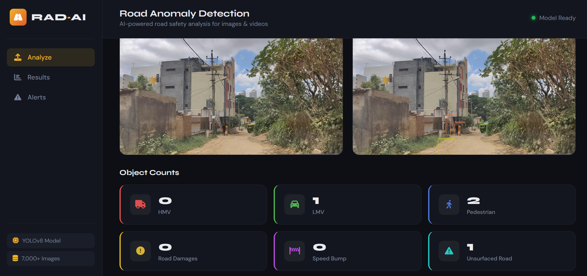
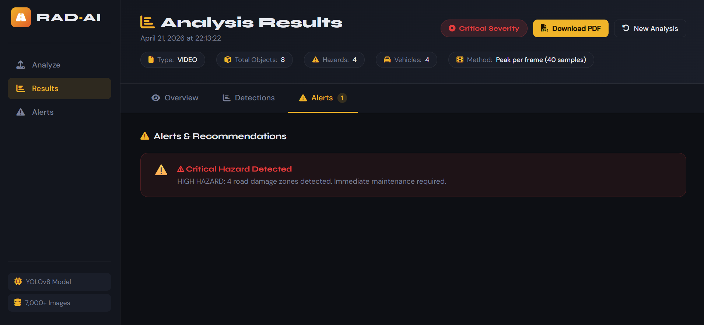
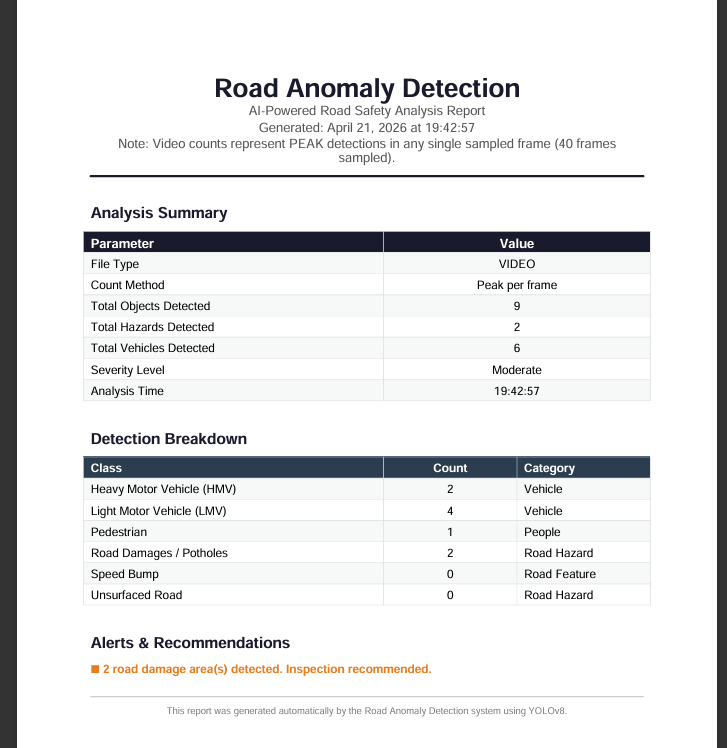
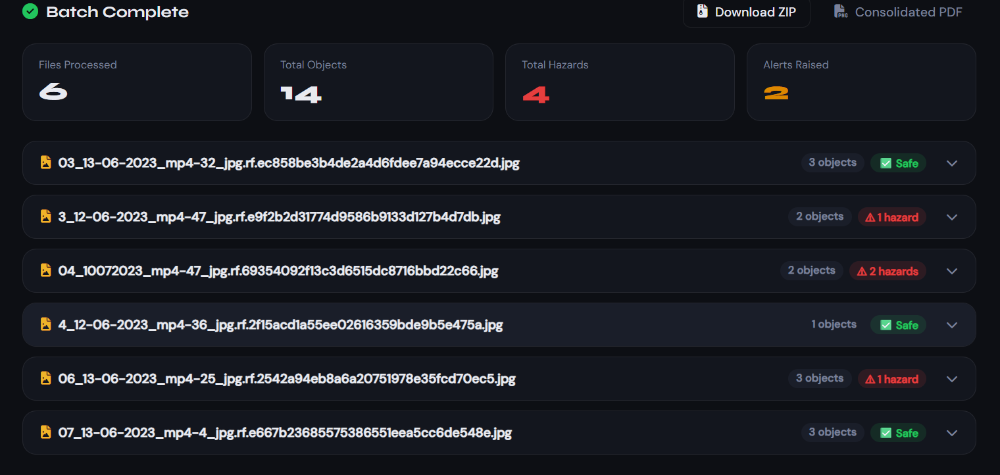
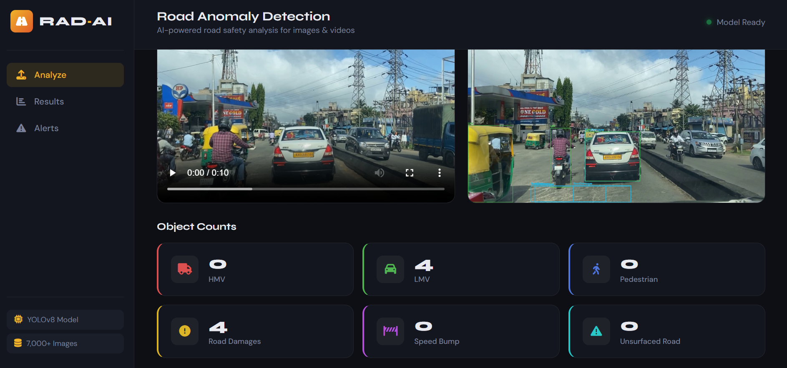
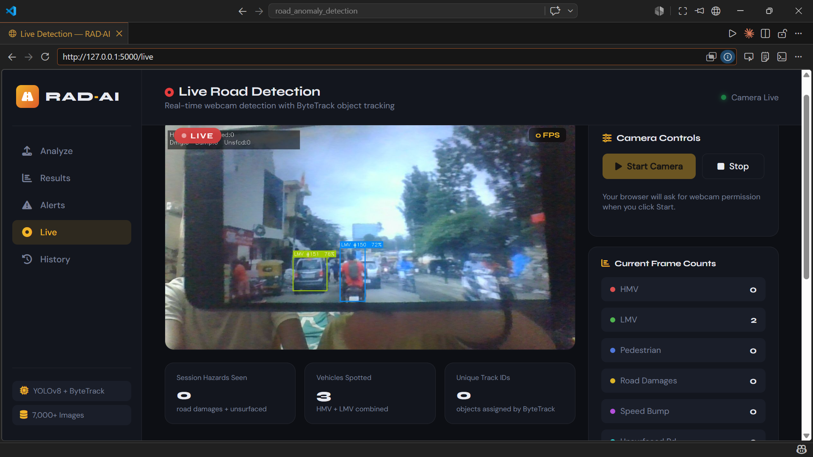
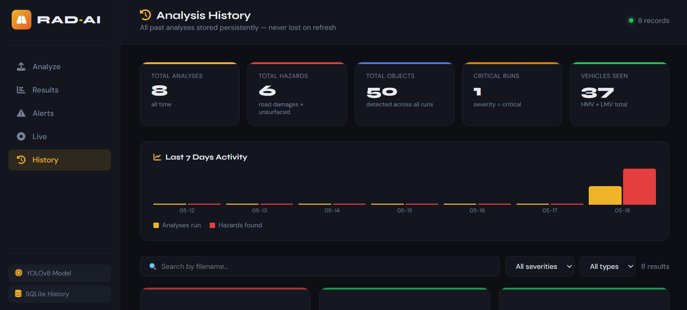

# Road Anomaly & Pothole Detection System
Developed an AI-powered Road Anomaly Detection System using YOLOv8, Flask, OpenCV, and PyTorch to detect and classify six road entities: potholes, speed bumps, unsurfaced roads, pedestrians, LMVs, and HMV vehicles. 
Implemented image/video analysis, annotated outputs, PDF report generation, and deployed the application for real-time web-based inference.


## Features
AI-powered road anomaly detection using YOLOv8
- Detects 6 road entities:
  - Potholes
  - Speed Bumps
  - Unsurfaced Roads
  - Pedestrians
  - LMV (Light Motor Vehicles)
  - HMV (Heavy Motor Vehicles)
- Image and video analysis support
- Real-time annotated output generation
- Confidence score summarization
- Automated alert generation based on road conditions
- PDF report generation for analysis results
- Batch image processing support
- Detection history tracking and storage
- Responsive Flask-based web interface
- Cloud deployed for online accessibility


## Tech Stack

### Frontend
- HTML5
- CSS3
- JavaScript

### Backend
- Flask
- Python

### AI / Machine Learning
- YOLOv8
- PyTorch
- OpenCV
- Ultralytics

### Data Processing & Visualization
- NumPy
- Pandas
- Matplotlib

### Database & Storage
- SQLite

### Report Generation
- ReportLab (PDF Generation)

### Deployment & Version Control
- Git
- GitHub
- Render


## Classes Detected

| Class | Description |
|---|---|
| Potholes | Detects road surface damages and potholes |
| Speed Bumps | Identifies speed breakers and raised road structures |
| Unsurfaced Roads | Detects damaged or unpaved road sections |
| Pedestrians | Detects people present on roads for safety analysis |
| LMV | Detects Light Motor Vehicles such as cars and bikes |
| HMV | Detects Heavy Motor Vehicles such as trucks and buses |


## Screenshots

### Home Page



---

### Detection Result



---

### Alert Generation



---

### PDF Report Generation



---

### Batch Analysis



---

### Video Analysis



---

### Webcam



---

### History Dashboard



## Live Demo

🔗 Deployed Application:  
[https://your-render-url.onrender.com](https://road-anomaly-detection.onrender.com)
---

## Installation & Setup

### 1. Clone the Repository

```bash
git clone https://github.com/ThisIsRitika/road-anomaly-detection.git
cd road-anomaly-detection
```

### 2. Create Virtual Environment

#### Windows

```python -m venv venv```

#### Linux / Mac

```source venv/bin/activate```

### 3. Activate Virtual Environment

```venv\Scripts\activate```

### 4. Install Dependencies

```pip install -r requirements.txt```

### 5. Run the Application

```python run.py```

## Usage

1. Upload an image or video containing road scenarios.
2. Select the preferred analysis mode.
3. The system detects and classifies:
   - Potholes
   - Speed Bumps
   - Unsurfaced Roads
   - Pedestrians
   - LMV (Light Motor Vehicles)
   - HMV (Heavy Motor Vehicles)
4. View annotated detection outputs with bounding boxes and confidence scores.
5. Generate and download PDF analysis reports.
6. Perform batch image analysis for multiple inputs.


## Future Scope

- Real-time CCTV and traffic camera integration
- GPS-based road anomaly mapping system
- Mobile application deployment
- Smart city infrastructure integration
- Cloud storage support for reports and outputs
- Real-time dashboard analytics and monitoring
- Edge AI deployment for low-latency detection
- Advanced road condition severity analysis
